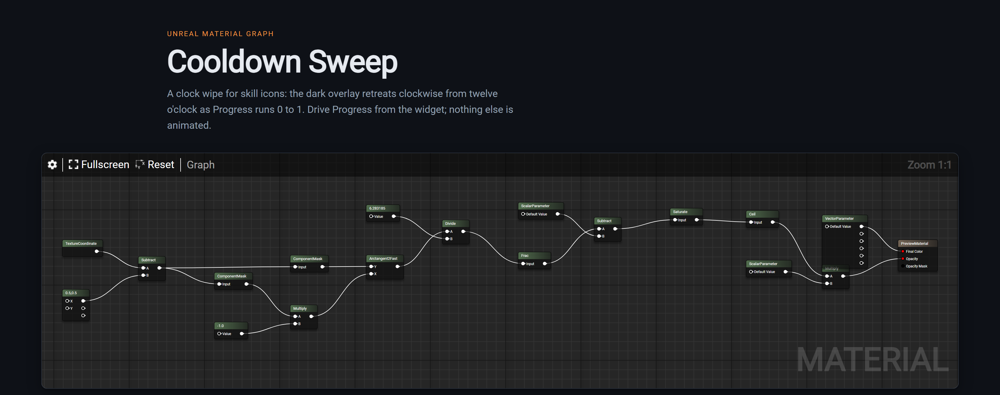

# unreal-graph-skills

Describe an Unreal node graph in a few lines, get back a real graph on a web page — and the T3D
to paste straight back into the editor it came from.

A [Claude Code](https://claude.com/claude-code) plugin shipping two skills. Terminal text is a
poor medium for a node network: pin-by-pin prose is slow to read and easy to get wrong. Each
skill turns a compact spec into the same text Unreal writes when you copy nodes, renders it
with blueprintue.com's own renderer, and produces one self-contained HTML file.

| Skill | Draws | Pastes into |
|---|---|---|
| `material-graph` | Material / shader networks | the Material Editor |
| `niagara-graph` | Niagara script graphs — scratch pad, module, dynamic input | a Niagara script graph |

[](https://hajh.github.io/unreal-graph-skills/cooldown-sweep.html)

<sub>**[Open the live graphs →](https://hajh.github.io/unreal-graph-skills/)** — pan, zoom, go
fullscreen, and copy the T3D. The still above is
[`examples/material/cooldown-sweep.spec.mjs`](examples/material/cooldown-sweep.spec.mjs),
rebuilt from source on every push.</sub>

```js
// examples/material/cooldown-sweep.spec.mjs, abridged
export default {
  material: "M_UI_CooldownSweep",
  title: "Cooldown Sweep",
  nodes: [
    { id: "uv", type: "TextureCoordinate" },
    { id: "half", type: "Constant2Vector", props: { R: "0.500000", G: "0.500000" } },
    { id: "centered", type: "Subtract", in: { A: "uv", B: "half" } },
    // …
    { id: "out", type: "MaterialOutputUI", in: { "Final Color": "tint", Opacity: "opacity" } },
  ],
};
```

```js
// examples/niagara/pop-fade.spec.mjs, abridged
export default {
  script: "SNM_PopFade",
  stage: "Particle Update",
  nodes: [
    { id: "map", type: "Input" },
    { id: "get", type: "MapGet", in: { Source: "map" }, params: [
      ["Particles.NormalizedAge", "float"], ["Module.PopScale", "float"] ] },
    { id: "falloff", type: "Op", op: "Numeric::OneMinus", in: { A: "get:Particles.NormalizedAge" } },
    // …
  ],
};
```

```
node build.mjs examples/niagara/pop-fade.spec.mjs pop-fade.html
  8 nodes, 29 pins, 11 wires
```

The domain is read off the spec: a `material` key builds a material graph, a `script` key builds
a Niagara one.

## Install

Clone anywhere and point Claude Code at it:

```
git clone https://github.com/HaJH/unreal-graph-skills.git ~/.claude/skills/unreal-graph
```

A plugin under your skills directory auto-loads on the next session, as `unreal-graph@skills-dir` —
no marketplace, no install step. The skills are then `/unreal-graph:material-graph` and
`/unreal-graph:niagara-graph`, and each fires on its own when a node setup of three or more
connected nodes comes up.

To try it without installing, `claude --plugin-dir ./unreal-graph-skills`.

Node 18+ is the only requirement. Nothing is installed, nothing is fetched at build time.

## What you get

- **A rendered graph** — real UE node boxes, typed pins, curved wires, pan and zoom, scaled to
  fit on load.
- **Pasteable T3D** — select it, `Ctrl+C`, then `Ctrl+V` in the editor. The network arrives with
  its wiring and layout intact.
- **One file, no network** — the renderer is inlined, so the page works offline and inside a
  strict CSP. Around 400–480 KB.

## Writing a spec

`in` maps **pin name → source**. A material spec taps a named output with `"node.PinName"`; a
Niagara spec uses `"node:PinName"`, because Niagara pin names are themselves dotted
(`Particles.NormalizedAge`). A bare `"node"` takes the first output either way.

Positions are optional. Nodes are layered by distance to the output, so constants and parameters
land directly in front of whatever consumes them, and rows relax toward each node's neighbours.
Set `x`/`y` on a node to pin it. `block: "Name"` groups nodes into a stage, laid out on its own
and wrapped in a comment box.

`title`, `summary` and `height` are optional page settings; a Niagara spec can also set `stage`
to draw the simulation stage the module belongs to.

Unknown node types, wires to nodes that do not exist, and pin names a node does not have all
fail the build.

### Material specifics

`props` are written verbatim into the expression, so quote the way Unreal does:
`ParameterName: '"PanSpeed"'`, floats as `"0.150000"`. State a value **once**, in `props` — the
pin's inline default is derived from it. A value lives twice in a material's T3D and Unreal
reads the pin when pasting, so a mismatch renders fine and pastes in wrong; the emitter refuses
to emit when the two drift. Niagara has no such trap, because a value lives only on the pin.

**274 expressions, generated from the engine.** `material/ue-material-api.mjs` is produced by
`material/generate-ue-api.mjs` reading an installed Unreal — pin names, pin order and output
shapes are the engine's own, not a transcription. Use the Unreal class name without the
`MaterialExpression` prefix (`Multiply`, `TextureSample`, `Fresnel`, `ComponentMask`), plus
short aliases for `Lerp`, `Dot`, `Cross`.

```
node material/generate-ue-api.mjs /path/to/UE_5.8
```

### Niagara specifics

Structural nodes are `Input`, `MapGet`, `MapSet`, `Op`, `FunctionCall`, `CustomHlsl` and
`Reroute`. Their pins are not fixed by class — a Map Get's pins **are** the parameters you ask
for — so a spec declares them:

```js
{ id: "get", type: "MapGet", in: { Source: "map" },
  params: [["Particles.NormalizedAge", "float"], ["Module.PopScale", "float"]] }
```

**99 operators, generated from the engine.** `niagara/ue-niagara-ops.mjs` is produced by
`niagara/generate-ops.mjs` parsing `FNiagaraOpInfo::Init` — one file, so an engine bump is one
re-read. Name an op the way the engine does: `Numeric::Add`, `Numeric::Lerp`, `Boolean::LogicAnd`.

```
node niagara/generate-ops.mjs /path/to/UE_5.8
```

An op the parser cannot resolve is listed in the generated file's header rather than guessed at.

**777 function scripts, generated from the assets.** A `FunctionCall` names an asset and its pins
come from the table, so a spec never lists them. Operators live in one engine C++ file, but a
function's pins live in its own `.uasset` — so that table is built by exporting the assets from
the editor once and parsing the export offline:

```
# in Unreal:  exec(open('<plugin>/niagara/export-functions.py').read())
node niagara/generate-functions.mjs <export dir>
```

The same sweep recovers the runtime type-index map that `FNiagaraVariable` needs.

[`reference/ENCODING.md`](reference/ENCODING.md) and
[`reference/ENCODING-NIAGARA.md`](reference/ENCODING-NIAGARA.md) document the two serialisation
formats, both verified against real editor copies.

## Examples

| | |
|---|---|
| [Cooldown Sweep](https://hajh.github.io/unreal-graph-skills/cooldown-sweep.html) | a clock wipe for skill icons, from the polar angle of the UV |
| [Shield Pulse](https://hajh.github.io/unreal-graph-skills/shield-pulse.html) | a fresnel rim modulated by a panning noise sample |
| [Dissolve with Burn Edge](https://hajh.github.io/unreal-graph-skills/dissolve-burn.html) | one subtraction driving both the clip mask and the glowing rim |
| [Hologram Scanlines](https://hajh.github.io/unreal-graph-skills/hologram-scanline.html) | scrolling scanlines and a rim, with nothing sampled |
| [Rounded Rectangle Mask](https://hajh.github.io/unreal-graph-skills/ui-rounded-rect.html) | a signed distance field in a `Custom` node |
| [Pop and Fade](https://hajh.github.io/unreal-graph-skills/pop-fade.html) | a Niagara scratch pad module scaling a sprite over its life |
| [Ease Fade](https://hajh.github.io/unreal-graph-skills/ease-fade.html) | alpha eased out in a Custom HLSL node, RGB left alone |
| [Velocity Blend](https://hajh.github.io/unreal-graph-skills/velocity-blend.html) | a call into an engine function script, pins and all |

## Known limits

- **A pasted comment box does not drag its contents until it is reselected.** Which nodes a box
  moves is rebuilt in Slate and never serialised, so a fresh paste starts empty. Click away and
  select the box again and group dragging works from then on.
- **Inline value fields are not drawn for material nodes.** The renderer disables pin inputs
  there, so a material constant shows its pins but not its numbers. Niagara pins do draw theirs.
- **`MaterialOutput` is display-only on paste.** Unreal allows one root per material and drops
  the pasted one; every other node still arrives.
- **Niagara type indices are per engine version.** An `FNiagaraVariable` stores its type as a
  runtime registry index, which the T3D carries verbatim. It is stable across editor restarts
  but not across engine versions — see `reference/ENCODING-NIAGARA.md` for how to reharvest it.
- **No one-click copy in a Claude Artifact.** The viewer frames the page cross-origin with no
  Permissions Policy delegation, so `clipboard-write` is never granted. The button selects the
  block instead and you press `Ctrl+C`.

## Licence

MIT — see [LICENSE](LICENSE). Vendored third-party code keeps its own terms; see
[THIRD_PARTY.md](THIRD_PARTY.md).
